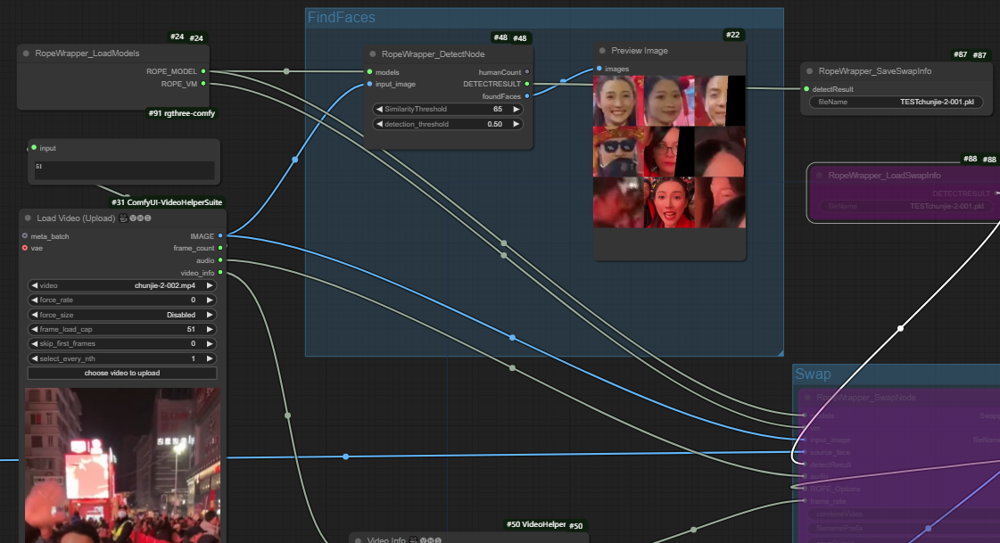
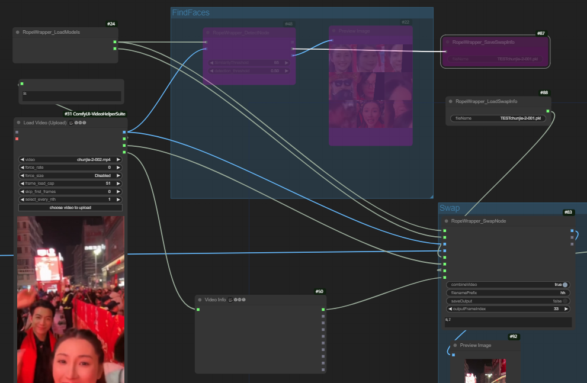

Wrap Rope into ComfyUI, do a little change to use in ComfyUI. All credit goes to Hillobar and his ROPE
https://github.com/Hillobar/Rope

### Installation:  ###
运行插件需要ComfyUI-VideoHelperSuite, ComfyUI-KJNodes . 因为修改过Rope的部分代码（一两行），为了避免Rope更新后插件失效，将Rope的代码加入了本仓库。再次声明Rope的代码版权属于原作者。
所需模型放置在本插件目录下的Models里。下载地址请访问Rope原仓库。https://github.com/Hillobar/Rope

To run this plugin, ComfyUI-VideoHelperSuite and ComfyUI-KJNodes are required. Since a few lines of code in Rope have been modified (one or two lines), the Rope code has been included in this repository to prevent the plugin from breaking in case of future Rope updates. Please note that the copyright for the Rope code belongs to its original author.
The required models should be placed in the Models directory within this plugin's folder. For the download links, please visit the original Rope repository: https://github.com/Hillobar/Rope.

Rope原本使用inswapper_128.fp16.onnx，在我自己的Windows环境下运行正常。但是在Linux上换脸结果很差。于是我选择切换到inswapper_128.onnx

Rope uses inswapper_128.fp16.onnx and it runs well on my Windows11. but when i put code on Linux, face will be ugly. i don't know why. so i switch to inswapper_128.onnx
RopeWrapper_LoadModel node now has a switch to choose between inswapper_128.fp16.onnx and  inswapper_128.onnx.
inswapper_128.onnx can be found on huggingface. this is one of them: [ inswapper_128.onnx](https://huggingface.co/ezioruan/inswapper_128.onnx)

### Usage:  ###
使用步骤：先执行FindFace部分，调整detection_threshold可以找到更多人脸，调整similarytyThreshold可以区分不同身份的人。得到人脸列表以及DeteceResult。DeteceResult可以直接发送到swap节点，也用save节点保存下来，在以后重复运行的时候节省处理时间。 

FindFace Section:
First, execute the FindFace section. Adjust the detection_threshold to detect more faces, and modify the similarityThreshold to differentiate between individuals. This will generate a list of faces along with the DetectResult. The DetectResult can be directly sent to the swap node or saved using the save node for future use, which helps save processing time when running the process again.

第二步是执行换脸，可以用Rope的全部参数进行微调。

Face Swapping:
Next, perform the face-swapping operation. You can fine-tune the process using all the parameters available in Rope.

### Face to Face:  ###
在RopeWrapper_SwapNode最底端的文本输入框，用于指定视频中的source人脸与将要更换的target人脸之间的关系。用分号分割，每一段对应一个target人脸。段里用逗号分割，每个数字对应一个source人脸。

例如“0,7;2"表示有两个target人脸。其中第一个人脸用于替换视频中发现的第0个和第7个source人脸，第二个targe人脸则替换第2个source人脸。如果留空，则进行简单的一一对应。

In the text input box at the bottom of the RopeWrapper_SwapNode, you can specify the relationship between the source faces in the video and the target faces to be swapped. Use semicolons (;) to separate each segment, where each segment corresponds to a target face. Within each segment, use commas (,) to separate the numbers, with each number representing a source face.

For example, "0,7;2" indicates two target faces:
The first target face will replace the 0th and 7th source faces found in the video.
The second target face will replace the 2nd source face.
If the input box is left empty, a simple one-to-one correspondence will be applied.

### Issue ###
原本计划使用ComfyUI-VideoHelperSuit里的Combine Video节点作为最终的视频合并。但是在测试过程中发现，swapNode如果保留全部视频帧，则需要大量显存或者内存（20G+）。于是参考Rope本身以及VideoHelperSuit的代码，直接在SwapNode节点里进行视频合并，这样使显存、内存占用都能维持在较低水平。但是在运行结束后，视频无法在节点下方直接显示，我修改了多次代码仍然无法解决。无奈之下只能通过ComfyUI的History列表来查看输出的视频。或者直接从服务器下载视频。希望有人能帮助我修改这部分代码。

Originally, I planned to use the Combine Video node from ComfyUI-VideoHelperSuite for the final video merging. However, during testing, I discovered that if the SwapNode retains all video frames, it requires a significant amount of GPU memory or RAM (20GB+). To address this, I referenced the code from both Rope and VideoHelperSuite and integrated the video merging process directly within the SwapNode. This approach keeps the GPU memory and RAM usage at a relatively low level.

Unfortunately, after the process completes, the video cannot be displayed directly below the node. Despite multiple attempts to modify the code, I have been unable to resolve this issue. As a workaround, the output video can be viewed through ComfyUI's History list or downloaded directly from the server.

I hope someone can assist in modifying this part of the code to enable direct video display below the node. Any help would be greatly appreciated!

### Original Rope README -  Thank you very much### 

Rope implements the insightface inswapper_128 model with a helpful GUI.
### [Discord](https://discord.gg/EcdVAFJzqp)

### [Donate](https://www.paypal.com/donate/?hosted_button_id=Y5SB9LSXFGRF2)

### [Wiki with install instructions and usage](https://github.com/Hillobar/Rope/wiki)

### [Demo Video (Rope-Ruby)](https://www.youtube.com/watch?v=4Y4U0TZ8cWY)

### ${{\color{Goldenrod}{\textsf{Last Updated 2024-05-27}}}}$ ###
### ${{\color{Goldenrod}{\textsf{Welcome to Rope-Pearl!}}}}$ ###

### Updates for Rope-Pearl-00: ###
### To update from Opal-03a, just need to replace the rope folder.
* (feature) Selectable model swapping output resolution - 128, 256, 512
* (feature) Better selection of input images (ctrl and shift modifiers work mostly like windows behavior)
* (feature) Toggle between mean and median merging withou having to save to compare
* (feature) Added back keyboard controls (q, w, a, s, d, space)
* (feature) Gamma slider
* 

### Performance:  ###
Machine: 3090Ti (24GB), i5-13600K

File: benchmark/target-1080p.mp4, 2048x1080, 269 frames, 25 fps, 10s

Rendering time in seconds (5 threads):

| Option | Crystal | Sapphire | Ruby | Opal | Pearl |
| --- | --- | --- | --- | --- | --- |
| Only Swap (128) | 7.3 | 7.5 | 4.4 | 4.3 | 4.4 |
| Swap (256) | --- | --- | --- | --- | 8.6 |
| Swap (512) | --- | --- | --- | --- | 28.6 |
| Swap+GFPGAN | 10.7 | 11.0 | 9.0 | 9.8 | 9.3 |
| Swap+Codeformer | 12.4 | 13.5 | 11.1 | 11.1 | 11.3 |
| Swap+one word CLIP | 10.4 | 11.2 | 9.1 | 9.3 | 9.3 |
| Swap+Occluder | 7.8 | 7.8 | 4.4 | 4.7 | 4.7 |
| Swap+MouthParser | 13.9 | 12.1 | 5.0 | 4.9 | 5.1 |

### Disclaimer: ###
Rope is a personal project that I'm making available to the community as a thank you for all of the contributors ahead of me.
I've copied the disclaimer from [Swap-Mukham](https://github.com/harisreedhar/Swap-Mukham) here since it is well-written and applies 100% to this repo.
 
I would like to emphasize that our swapping software is intended for responsible and ethical use only. I must stress that users are solely responsible for their actions when using our software.

Intended Usage: This software is designed to assist users in creating realistic and entertaining content, such as movies, visual effects, virtual reality experiences, and other creative applications. I encourage users to explore these possibilities within the boundaries of legality, ethical considerations, and respect for others' privacy.

Ethical Guidelines: Users are expected to adhere to a set of ethical guidelines when using our software. These guidelines include, but are not limited to:

Not creating or sharing content that could harm, defame, or harass individuals. Obtaining proper consent and permissions from individuals featured in the content before using their likeness. Avoiding the use of this technology for deceptive purposes, including misinformation or malicious intent. Respecting and abiding by applicable laws, regulations, and copyright restrictions.

Privacy and Consent: Users are responsible for ensuring that they have the necessary permissions and consents from individuals whose likeness they intend to use in their creations. We strongly discourage the creation of content without explicit consent, particularly if it involves non-consensual or private content. It is essential to respect the privacy and dignity of all individuals involved.

Legal Considerations: Users must understand and comply with all relevant local, regional, and international laws pertaining to this technology. This includes laws related to privacy, defamation, intellectual property rights, and other relevant legislation. Users should consult legal professionals if they have any doubts regarding the legal implications of their creations.

Liability and Responsibility: We, as the creators and providers of the deep fake software, cannot be held responsible for the actions or consequences resulting from the usage of our software. Users assume full liability and responsibility for any misuse, unintended effects, or abusive behavior associated with the content they create.

By using this software, users acknowledge that they have read, understood, and agreed to abide by the above guidelines and disclaimers. We strongly encourage users to approach this technology with caution, integrity, and respect for the well-being and rights of others.

Remember, technology should be used to empower and inspire, not to harm or deceive. Let's strive for ethical and responsible use of deep fake technology for the betterment of society.

  
